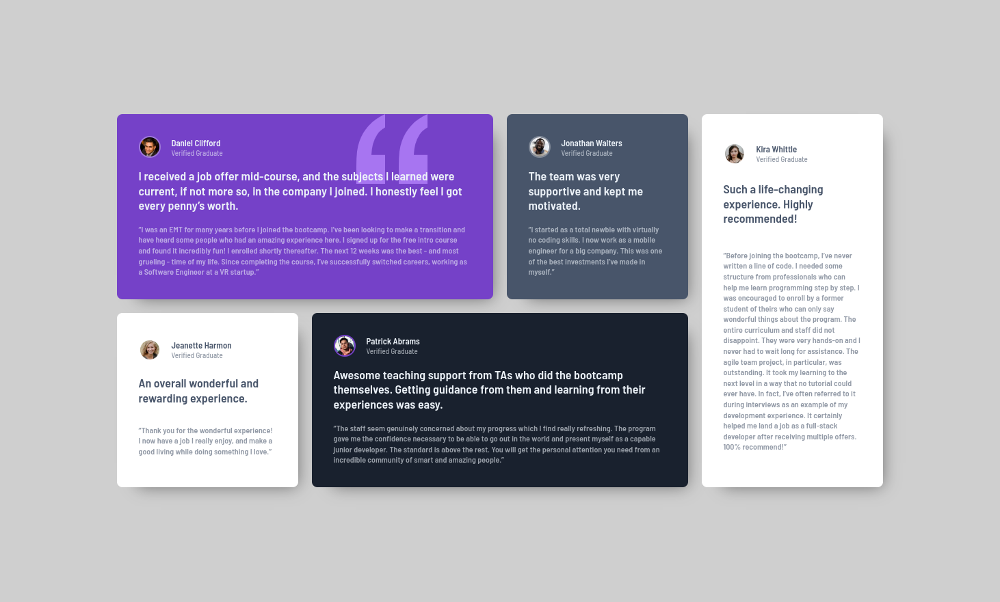

# Frontend Mentor - Testimonials grid section solution

This is a solution to the [Testimonials grid section challenge on Frontend Mentor](https://www.frontendmentor.io/challenges/testimonials-grid-section-Nnw6J7Un7). Frontend Mentor challenges help you improve your coding skills by building realistic projects. 

### Screenshot
- mobile

- desktop

### Links

- Solution URL: [See in Frontend Mentor](https://www.frontendmentor.io/solutions/testimonial-grid-in-react-eIjOR_GHNg

)
- Live Site URL: [Hosted on Vercel](https://fm-testimonial-grid-kappa.vercel.app/)

## My process

### Built with
- [React](https://reactjs.org/) - JS library
- Mobile-first workflow
- Semantic HTML5 markup
- CSS custom properties
- Flexbox
- CSS Grid

## Author

- Website - [keiner mendoza](https://keinermendoza.com)
- Frontend Mentor - [@keinermendoza](https://www.frontendmentor.io/profile/keinermendoza)